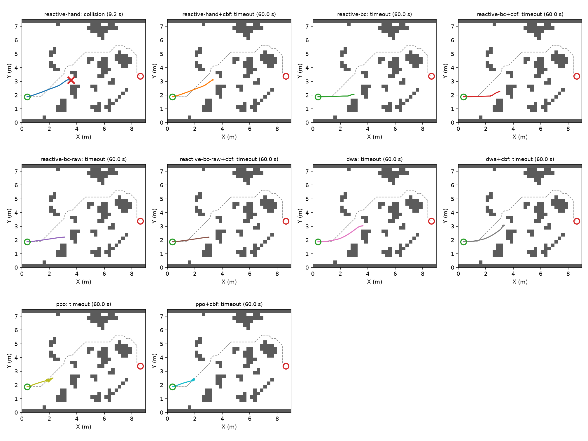
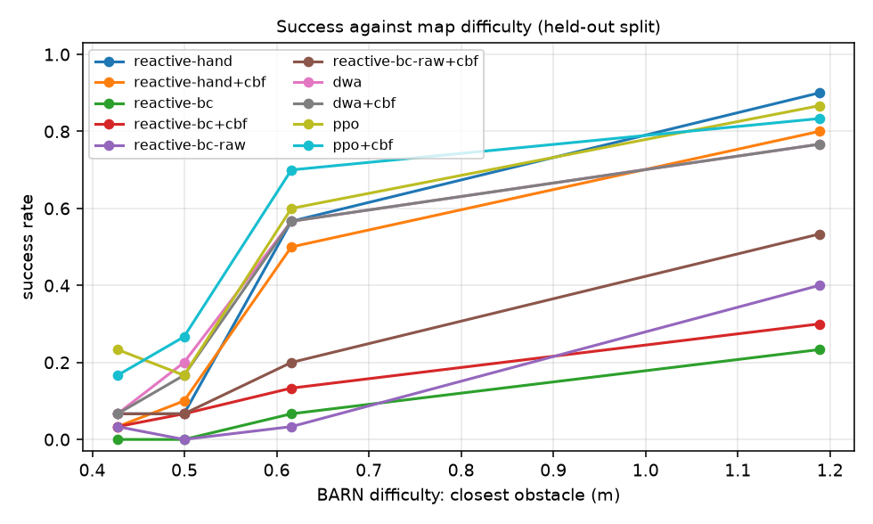
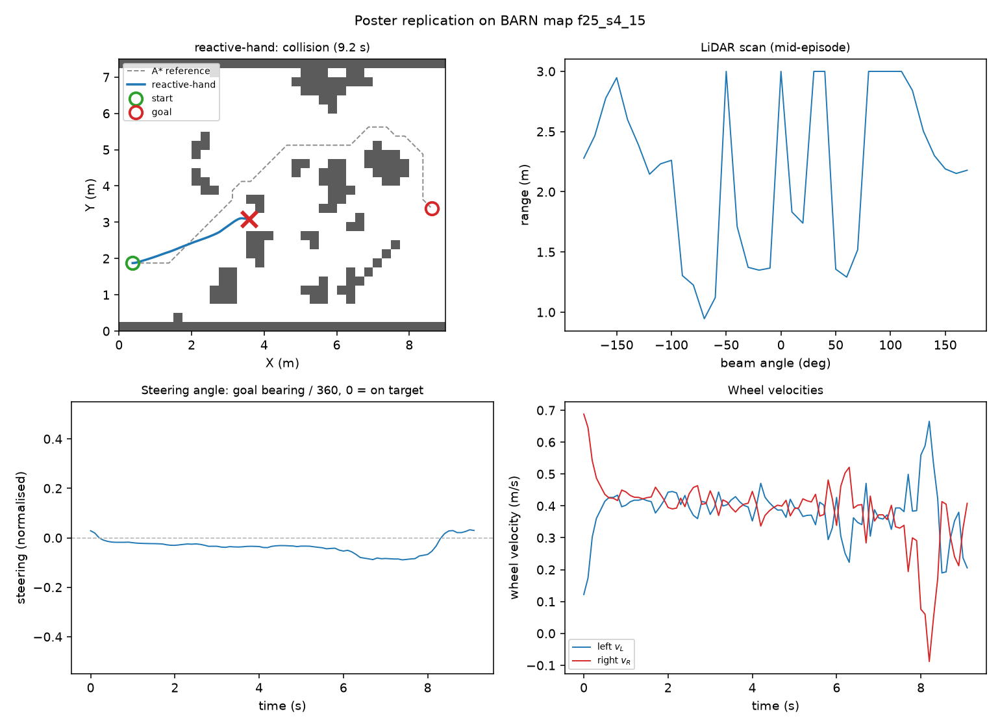

# lidar-nav-cbf

[](https://github.com/AnjanaSuresh01/lidar-nav-cbf/actions/workflows/ci.yml)

**Reactive, classical and learned LiDAR local planners under a control-barrier-function safety filter, benchmarked on 300 BARN-specification maps.**

This started as a replication of a course poster: a neural reactive navigator for
a differential-drive robot, demonstrated on one 4 x 6 m map with one run, no
baseline and no metric. The controller is reproduced here exactly — it is the
first arm in the table — and then asked the questions a single run cannot answer:

* Where does it stop working, as a function of measured map difficulty?
* The poster calls it a neural network but never trains it. **How much of its
  performance gap is the architecture, and how much is that nobody fitted the
  weights?**
* If you bolt a formally-motivated safety filter onto a local planner, what does
  it actually buy, and what does it cost?

The third question turns out to have the least comfortable answer.

## Results

120 held-out maps, generated to the BARN specification, none seen during
training or tuning. Full tables and per-episode records in [RESULTS.md](RESULTS.md).

| arm | success | collision | froze | SPL | BARN |
| --- | --- | --- | --- | --- | --- |
| `reactive-hand` — the poster's controller | 0.400 | **0.600** | 0.000 | 0.400 | 0.174 |
| `reactive-hand+cbf` | 0.358 | **0.000** | 0.667 | 0.355 | 0.149 |
| `reactive-bc` — same net, cloned from DWA | 0.075 | 0.333 | 0.667 | 0.067 | 0.030 |
| `reactive-bc-raw` — cloned, raw ranges | 0.117 | 0.650 | 0.308 | 0.104 | 0.053 |
| `dwa` | 0.400 | 0.000 | **0.600** | 0.400 | 0.200 |
| `dwa+cbf` | 0.392 | 0.017 | 0.600 | 0.389 | 0.193 |
| `ppo` | 0.467 | 0.225 | 0.350 | 0.447 | 0.228 |
| **`ppo+cbf`** | **0.492** | **0.008** | 0.517 | **0.462** | **0.242** |

Four things came out of this, and three of them contradict what I expected.

**1. A safety filter earns its keep only against a policy that is actually
unsafe.** On PPO — which collides on 22.5% of maps — the filter removes 96% of
those collisions (0.225 → 0.008, one map in 120) *and raises* success, 0.467 →
0.492. On DWA, which is already collision-free, it is pure cost: success 0.400 →
0.392, and it *introduces* a collision on two maps that DWA itself never hit.
The filter's barrier is built from the beams the scanner returned, while DWA
rejects whole candidate arcs against the entire scan geometry; constraining the
sampled points is genuinely weaker. **Bolting a safety filter onto a planner that
is already safe made it marginally less safe.**

**2. The filter converts collisions into freezes, not into successes.** The
clearest case is the poster's own controller: 60% collisions become 0%, but
success barely moves (0.400 → 0.358) because the freeze rate goes 0% → 66.7%.
That is the whole trade in one row. A filter is a failure-mode transformer, and
whether that is worth it depends entirely on which failure you can tolerate — a
question the metric "collision rate" cannot answer on its own, which is why the
freeze rate is reported next to it everywhere here.

**3. On easy maps the poster's controller is the best planner here. On hard maps
it is the worst.** Success by quartile of mean path clearance:

| arm | 0.39–0.46 m | 0.46–0.54 m | 0.54–0.70 m | 0.70–1.68 m |
| --- | --- | --- | --- | --- |
| `reactive-hand` | 0.07 | 0.07 | 0.57 | **0.90** |
| `dwa` | 0.07 | 0.20 | 0.57 | 0.77 |
| `ppo` | **0.23** | 0.17 | 0.60 | 0.87 |
| `ppo+cbf` | 0.17 | **0.27** | **0.70** | 0.83 |

In the open quartile the poster's controller scores **0.90**, beating both DWA
(0.77) and PPO (0.87) — it barrels down clear corridors while they hesitate. In
the tightest quartile it scores **0.07**, a thirteen-fold collapse. Aggregate
success (0.400) hides both halves of that, and DWA reaches the identical 0.400
by the mirror-image route: recklessness (60% collision, 0% freeze) versus caution
(0% collision, 60% freeze).

This is the concrete case against single-map evaluation. Demonstrate this
controller on one open map — which is roughly what the source poster does — and
it looks state of the art.

**4. Training the poster's network made it worse than hand-wiring it.** This is
the one I got backwards. The poster never fits its weights, so the obvious
hypothesis was that the missing training was the problem. Behaviour-cloning a
competent DWA teacher into the poster's exact architecture scores **0.075**,
against **0.400** for the same architecture with hand-designed Braitenberg
weights. Swapping the poster's `1/d` encoding for raw ranges recovers only a
little (0.117), so the inverse encoding is not the binding constraint either.
The honest reading is bounded: under noise-injected behaviour cloning this
architecture does not absorb a planner's decision function, and I did not run
DAgger, so 0.075–0.117 bounds it from below rather than characterising it.

## The same map, every planner



## Success against measured map difficulty



## The poster's own four panels, reproduced



## Layout

```
src/bahn/
  world.py       BARN-spec map generation, A* reference paths, difficulty metrics
  geometry.py    vectorised LiDAR ray casting and exact disc clearance
  sim.py         batched differential-drive simulator
  gym_env.py     Gymnasium env + Stable-Baselines3 VecEnv
  metrics.py     success / SPL / BARN score / freeze rate
  rollout.py     the episode runner every experiment shares
  tuning.py      grid search for the hand-set constants, training split only
  planners/      reactive (poster), dwa, learned (behaviour clone + PPO)
  safety/        exact 2-variable QP solver, LiDAR CBF filter
docs/
  benchmark.md      the suite, the splits, the metrics
  planners.md       the four arms, and two bugs worth recording
  safety-filter.md  the CBF construction and what it does not promise
results/            committed JSON for every number in RESULTS.md
```

## Reproduce

```bash
pip install -e ".[dev,learn,viz]"

bahn maps                      # regenerate the 300-map suite, print difficulty
bahn tune                      # grid-search reactive gains + filter geometry
bahn bc                        # behaviour-clone the poster net from DWA
bahn bc --encoding raw         # same net, raw ranges instead of 1/d
bahn ppo --steps 2000000       # train the PPO local planner (~10 min, CPU)
bahn eval                      # score every arm on the held-out split
bahn ablate                    # sweep the filter's look-ahead distance
bahn figures                   # render trajectory and difficulty plots
pytest -q                      # 71 tests
```

Nothing is committed as data. The suite is a deterministic function of its
parameters — the seed for each map derives from
`(fill, iterations, repetition, attempt)` — so regenerating it on another machine
produces byte-identical grids.

Training artefacts are written **outside** the repository, to `%LOCALAPPDATA%/bahn-work`
or `$BAHN_WORK_DIR`. That is not tidiness: the development machine keeps this
repository in a synced folder, where writing many files starves the training
process of CPU.

## What is measured, and what is not

**Measured.** Everything in `RESULTS.md`: outcome rates, SPL, BARN score, freeze
rate, minimum clearance, filter intervention and relaxation rates, all on 120
held-out maps no arm was tuned or trained on.

**Not measured.**

* **No real robot.** This is a 2-D kinematic simulation. There is no wheel slip,
  no localisation error, no LiDAR noise, no compute budget. A planner that works
  here has cleared a low bar.
* **No dynamic obstacles.** All maps are static. The freezing behaviour the
  filter induces would be considerably worse around moving obstacles.
* **No ROS 2 integration.** The planners implement a `(observation) -> twist`
  interface that a ROS 2 node would wrap, but no such node is written or run
  here, and the repository claims nothing about real-time performance.
* **The behaviour-cloned arm is a lower bound.** It is trained by noise-injected
  behaviour cloning, not DAgger, so its score bounds the architecture's ability
  from below rather than characterising it.

## References

* Perille, Truong, Xiao & Stone. *Benchmarking Metric Ground Navigation*, SSRR 2020. [arXiv:2008.13315](https://arxiv.org/abs/2008.13315) — the map generation specification and difficulty metrics.
* [The BARN Challenge](https://people.cs.gmu.edu/~xiao/Research/BARN_Challenge/) (ICRA) — the scoring formula.
* Fox, Burgard & Thrun. *The Dynamic Window Approach to Collision Avoidance*, IEEE RAM 1997 — the classical baseline.
* Anderson et al. *On Evaluation of Embodied Navigation Agents*, 2018. [arXiv:1807.06757](https://arxiv.org/abs/1807.06757) — SPL.
* Ames, Xu, Grizzle & Tabuada. *Control Barrier Function Based Quadratic Programs for Safety Critical Systems*, IEEE TAC 2017 — the filter.

## Licence

MIT.
